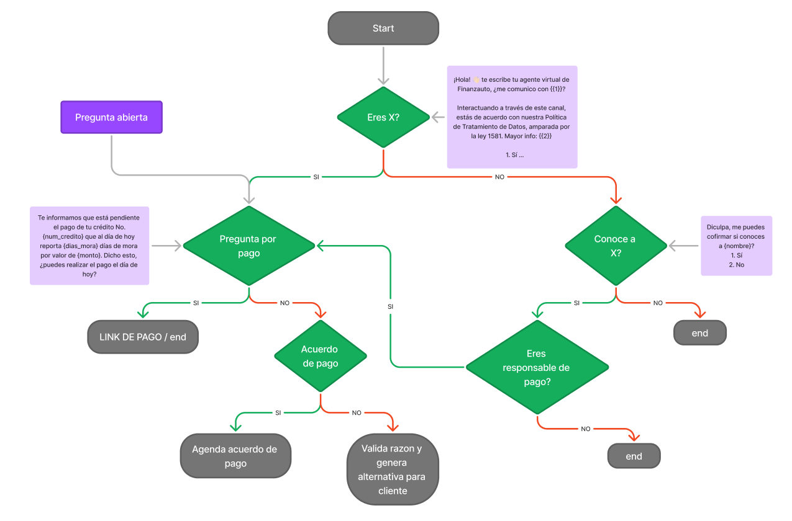

# Chatbot_cobranza_whatsapp
Chatbot de Cobranza y Servicio al Cliente con Flask y Twilio


hatbot de Cobranza y Servicio al Cliente con Flask y Twilio
Este componente está diseñado para manejar la cobranza y servicio al cliente a través de WhatsApp, utilizando Flask y Twilio. El flujo principal incluye:

* Integración con Twilio: Utiliza la API de Twilio para enviar y recibir mensajes de WhatsApp, automatizando las interacciones con los clientes.
* Caché de Sesión: Mantiene un caché de sesión para rastrear el estado de la conversación con cada cliente y gestionar el flujo de mensajes.
* Manejo de Conversaciones: Las conversaciones se guardan en un archivo CSV, registrando el número de teléfono, el mensaje y su origen (cliente o chatbot).
* Flujo de Cobranza: Si se detecta que el cliente tiene un crédito pendiente, el sistema inicia un flujo de cobranza basado en la base de datos de cobranza cargada. Si no hay crédito, se redirige a un flujo de servicio al cliente utilizando otro modelo de procesamiento.
* Automatización: La aplicación envía automáticamente un mensaje inicial a todos los clientes en la base de cobranza cuando se inicia la aplicación, iniciando el flujo de cobranza.
* Estas dos aplicaciones son independientes pero podrían integrarse en una solución más amplia para automatizar tanto la generación de reportes financieros como la gestión de la cobranza y servicio al cliente.


# Chatbot de Cobranza y Servicio al Cliente con Flask y Twilio

Este proyecto es un aplicativo diseñado para manejar la cobranza y el servicio al cliente a través de WhatsApp, utilizando Flask y Twilio. El flujo de trabajo automatizado permite la interacción efectiva con los clientes, proporcionando una solución eficiente y escalable para la gestión de deudas y la atención al cliente.

## Funcionalidades Principales

### 1. **Integración con Twilio**
- El sistema utiliza la API de Twilio para enviar y recibir mensajes de WhatsApp.
- Se configura un número de WhatsApp dedicado (`TWILIO_WHATSAPP_NUMBER`) para gestionar las comunicaciones.

### 2. **Manejo de Conversaciones**
- Las conversaciones con los clientes se registran en un archivo CSV, capturando el número de teléfono, el mensaje, el origen (cliente o chatbot), y la fecha y hora de la interacción.
- Las conversaciones se gestionan a través de un sistema de caché que almacena el estado de la conversación (por ejemplo, el paso actual en el flujo de cobranza).

### 3. **Flujo de Cobranza**
- La aplicación carga una base de datos de cobranza desde un archivo Excel (`Base_cobranza.xlsx`).
- Se envía automáticamente un mensaje inicial a cada cliente en la base de datos, iniciando el flujo de cobranza.
- El sistema determina si el cliente tiene un crédito pendiente y ajusta el flujo de conversación en consecuencia.
- Si el cliente tiene un crédito, el chatbot gestiona la conversación para facilitar el pago o acordar condiciones.
- Si no hay crédito pendiente, el sistema redirige la conversación al servicio al cliente, utilizando un flujo separado.

### 4. **Flujo de Servicio al Cliente**
- Si no se detecta un crédito pendiente, el sistema utiliza un flujo alternativo diseñado para responder a preguntas y resolver problemas de servicio al cliente.
- Este flujo es manejado por una función separada (`process_chat_sac`), que mantiene el contexto de la conversación en caché para personalizar las respuestas.

### 5. **Automatización y Escalabilidad**
- El aplicativo está diseñado para funcionar en un servidor Flask, permitiendo su fácil despliegue y escalabilidad.
- Se automatiza el envío de mensajes y la gestión de respuestas, reduciendo la necesidad de intervención manual.

## Estructura del Código

- **`app.py`**: Archivo principal que configura Flask y define las rutas para manejar las solicitudes entrantes de Twilio.
- **`process_chat.py`**: Función que maneja el flujo de cobranza, decidiendo el siguiente paso basado en la entrada del usuario y el estado actual.
- **`process_chat_sac.py`**: Función que maneja el flujo de servicio al cliente, respondiendo a las consultas basadas en el contexto de la conversación.
- **`conversaciones.csv`**: Archivo donde se registran todas las interacciones con los clientes.


## Instalación

1. Clona el repositorio.
2. Instala las dependencias necesarias utilizando usando Python 3.12.3 `pip install -r requirements.txt`.
3. Configura las variables de entorno para Twilio y Flask.

## Uso

Ejecuta la aplicación Flask para iniciar el servidor y comenzar a recibir y enviar mensajes a través de WhatsApp.

```bash
python twilio_app.py
```


## Despliegue

- El aplicativo se ejecuta en un servidor Flask, configurado para escuchar en el puerto 5000 el cual debe ser modificado en el aplicativo de twilio para su escucha activa.
- Twilio se encarga de las comunicaciones con los clientes a través de su API, facilitando la integración con WhatsApp.

Este sistema proporciona una solución integral para la automatización de cobranza y servicio al cliente, utilizando las capacidades de Flask y Twilio para ofrecer un servicio eficiente y personalizado a gran escala.